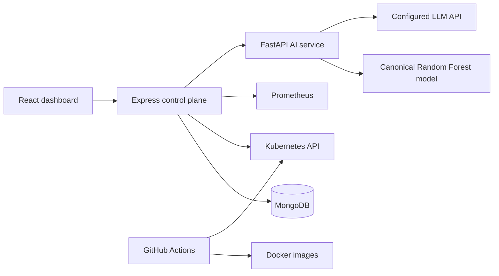

# AI DevOps Copilot

AI DevOps Copilot is a final-year CSE project that connects CI/CD, Kubernetes observations, Prometheus telemetry, a Random Forest predictor, structured LLM root-cause analysis, deterministic recovery controls, and verification. It is an experimental, controlled-autonomy implementation—not a production operations platform.

## What is implemented

- React/Vite operations dashboard with services, deployments, incidents, copilot analysis, recovery audit history, and explicit unavailable states.
- Node.js/Express control plane with MongoDB audit records and authenticated APIs.
- FastAPI AI service using the canonical `ml/model.joblib` Random Forest artifact.
- Exact eight-feature precursor contract: `cpu_usage`, `memory_usage`, `restart_count`, `error_rate`, `response_time`, `recent_deployment`, `log_error_count`, and `event_count`.
- Evidence-bound RCA: logs, Kubernetes events, pod/deployment state, and prediction are supplied to the LLM; the LLM cannot execute commands.
- Typed, allowlisted Kubernetes recovery: restart a Deployment-owned pod, scale a Deployment, revision-aware rollback, or controlled pod recreation.
- Recovery verification requires rollout/readiness and a post-action Prometheus query. Missing verification produces `RECOVERY_INCONCLUSIVE`.
- GitHub Actions validation, container builds, and an opt-in, secret-gated Kubernetes deployment job for the existing demo workload.
- Fail-closed live E2E runner for a separately configured Kubernetes/Prometheus environment.

## Architecture



See [final technical documentation](docs/FINAL_TECHNICAL_DOCUMENTATION.md) and [testing and safety record](docs/FINAL_TESTING_AND_SAFETY.md) for the implemented data flow, boundaries, and limitations.

## Repository layout

| Path | Purpose |
|---|---|
| `frontend/` | React/Vite dashboard |
| `backend/` | Express API, MongoDB models, Kubernetes/Prometheus clients |
| `ai-service/` | FastAPI prediction and RCA service |
| `ml/` | Canonical features, training pipeline, model artifact, tests |
| `sample-app/` | Controlled demo workload |
| `k8s/` | Existing RBAC, demo workload, and Prometheus manifests |
| `.github/workflows/build.yml` | CI/CD workflow |
| `scripts/e2e_live_control_loop.js` | Fail-closed live E2E runner |

## Prerequisites

- Node.js 20 (CI version; current local Node should be compatible)
- Python 3.11
- MongoDB for backend persistence
- Docker Desktop for Compose/container use
- Kubernetes and Prometheus only for live deployment, self-healing, or E2E verification

Copy `.env.example` to `.env` and configure secrets locally. Do not commit populated environment files. At minimum, backend startup needs `MONGO_URI` and `JWT_SECRET`; live copilot analysis additionally needs Kubernetes, Prometheus, and AI-service configuration.

## Local development

Run the stack with Docker Compose:

```bash
docker compose up --build
```

`JWT_SECRET` must be supplied to Compose. The standard local endpoints are frontend `http://localhost:5173`, backend `http://localhost:5000`, AI service `http://localhost:8000`, and Prometheus `http://localhost:9090`.

Or start services individually:

```bash
npm --prefix backend install
npm --prefix backend start

python -m pip install -r ai-service/requirements.txt
python ai-service/main.py

npm --prefix frontend install
npm --prefix frontend run dev
```

## Validation

```bash
npm --prefix backend test
python -m pytest ai-service/tests ml/tests
npm --prefix frontend run build
git diff --check
```

## Kubernetes and CI/CD

The existing manifests deploy only the demo checkout workload and Prometheus in the `devops-copilot` namespace. Backend, frontend, AI service, and MongoDB have Docker support but no Kubernetes manifests in this repository.

GitHub Actions runs on push, pull request, and manual dispatch. Main-branch publishing/deployment requires `DOCKERHUB_USERNAME`, `DOCKERHUB_TOKEN`, and `KUBE_CONFIG`. It fails if validation, image build/push, Kubernetes apply, rollout/readiness, or the demo workload health endpoint fails. See [Phase 7](docs/PHASE7_GITHUB_ACTIONS_DEPLOYMENT.md).

## Live E2E

The live runner requires a valid backend JWT, a registered Kubernetes-backed service, and reachable backend, MongoDB, AI, Kubernetes, and Prometheus dependencies:

```powershell
$env:E2E_AUTH_TOKEN = '<valid JWT>'
$env:BACKEND_URL = 'http://localhost:5000'
$env:PROMETHEUS_URL = 'http://localhost:9090'
node scripts/e2e_live_control_loop.js
```

Live Kubernetes/Prometheus E2E has not been executed in the current environment because its local Kubernetes endpoint was unavailable and no integrated credentials were supplied. See [Phase 9](docs/PHASE9_END_TO_END_TESTING.md).

## Status and limitations

Automated backend tests, AI/ML tests, frontend production build, syntax/preflight checks, Compose configuration validation, and YAML parsing have passed during the recorded phases. Those checks do not prove live deployment or recovery success.

Key limitations include synthetic ML training data, no current live E2E evidence, process-local recovery locking, non-transactional audit writes, and limited Kubernetes manifests. See the final documentation for details.
