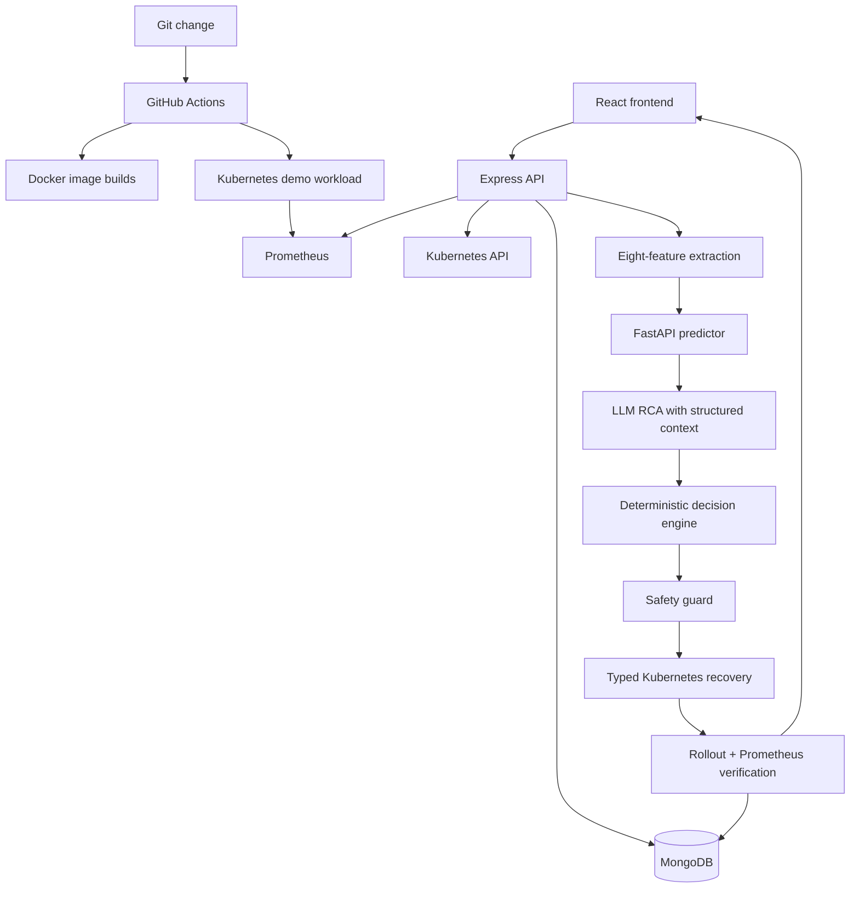
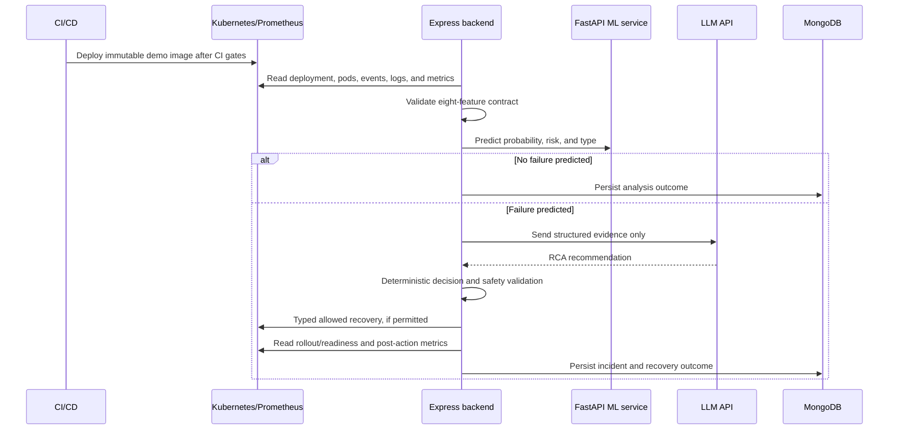

# Final Technical Documentation

## 1. Overview

**Project:** AI DevOps Copilot — AI Agent for Autonomous CI/CD Failure Prediction and Self-Healing.

Cloud-native incident response commonly combines monitoring alerts with manual investigation and remediation. This project investigates a narrower, controlled loop: collect evidence from Kubernetes and Prometheus, predict risk using a trained classifier, request structured RCA from an LLM, select a deterministic allowed action, validate safety constraints, execute a typed Kubernetes operation, and verify the outcome.

The objective is not unrestricted or production-grade autonomy. It is a demonstrable control loop for a small allowlist of Kubernetes scenarios. Live cluster, Prometheus, and integrated end-to-end validation were not executed in the current environment.

## 2. Implemented architecture

| Component | Implemented responsibility |
|---|---|
| React/Vite frontend | Authenticated operations dashboard, incident ledger, deployment/recovery audit views, and copilot control-loop display. It displays unavailable data as unavailable. |
| Express backend | Authenticated API, service/deployment/incident/recovery persistence, Kubernetes and Prometheus integration, and control-loop orchestration. |
| MongoDB | Service, deployment, incident, recovery action, SLO, metric, requirement, and user records. |
| FastAPI AI service | Canonical model inference and structured LLM RCA endpoint. |
| ML pipeline | Random Forest binary failure and multiclass failure-type models using `ml/model.joblib`. |
| Kubernetes | Existing RBAC, Prometheus, and `demo-checkout-service` manifests. |
| GitHub Actions | Validation, image builds, secret-gated Docker Hub publishing, and secret-gated deployment of existing demo manifests. |

The repository has Dockerfiles for backend, frontend, AI service, and demo workload. Only the demo workload and Prometheus currently have Kubernetes manifests.

## 3. End-to-end control flow

Prediction is numerical ML inference. Diagnosis is LLM interpretation of backend-provided evidence. Decision is a backend-owned evidence mapping; an LLM recommendation alone cannot authorize an action. Recovery is a typed API operation. Verification is separate from dispatch and determines the final status.

## 4. Machine learning

The canonical feature contract is enforced by `ml/features.py`, the FastAPI schema, and backend feature extraction:

| Feature | Source in control loop |
|---|---|
| `cpu_usage` | Prometheus CPU usage divided by Deployment CPU limit |
| `memory_usage` | Prometheus memory usage divided by Deployment memory limit |
| `restart_count` | Kubernetes pod container restart counts |
| `error_rate` | Prometheus request error-rate metric |
| `response_time` | Prometheus P95 latency, converted to milliseconds |
| `recent_deployment` | Kubernetes Deployment condition timing |
| `log_error_count` | Error-pattern count from collected pod logs |
| `event_count` | Relevant Kubernetes events |

`pod_status`, `deployment_status`, and `health_status` are forbidden model features. Missing required telemetry produces `TELEMETRY_UNAVAILABLE`; no values are invented. The model returns failure probability, `LOW`/`MEDIUM`/`HIGH` risk, predicted failure type, feature signals, model version, and feature-schema version.

Training uses the repository's synthetic precursor telemetry dataset with deterministic train/validation/test splits. `ml/evaluation.json` records synthetic held-out results, including binary accuracy of approximately 0.9143 and multiclass accuracy of approximately 0.6495 for the checked-in artifact evaluation. These are **not production metrics**, not live performance measurements, and not evidence of operational reliability. No real-world benchmark, production precision/recall, latency, or recovery-success measurement was performed.

## 5. AI/RCA, decision, and safety

The backend supplies logs, Kubernetes events, pod state, deployment conditions, and prediction context to the AI service. The LLM returns a structured RCA with likely cause, recommended action, reasoning, and bounded confidence. Invalid or unavailable LLM output returns `LLM_UNAVAILABLE`; it is not replaced with a fabricated RCA.

The deterministic decision engine recognizes evidence patterns for failed rollout, resource pressure, crash-loop/error evidence, and missing/unhealthy workload evidence. It only allows:

- `RESTART_POD`
- `SCALE_DEPLOYMENT`
- `ROLLBACK_DEPLOYMENT`
- `RECREATE_RESOURCE`

The safety guard requires a registered service target, allowed namespace, allowed action, explicit `COPILOT_RECOVERY_ENABLED=true`, Kubernetes credentials, and MongoDB audit availability. It also claims the namespace/deployment target in a process-local lock; a concurrent claim returns `RECOVERY_ALREADY_RUNNING`.

The AI has no interface for shell commands, `kubectl` strings, arbitrary YAML, arbitrary resource names, credentials, or GitHub mutation. Kubernetes operations are backend-owned typed functions.

## 6. Self-healing and verification

| Action | Implemented operation |
|---|---|
| Pod restart | Delete a selected pod owned by the configured Deployment and let the Deployment controller replace it. |
| Scale Deployment | Patch the Deployment scale subresource with a controlled replica count. |
| Revision-aware rollback | Select an owned earlier ReplicaSet revision and patch the Deployment template. |
| Controlled recreation | Reuse the controlled Deployment-owned pod recreation path. |

Each action captures target, start/completion times, before/after state, dispatch result, error, and verification outcome. A verified result requires both existing rollout/readiness evaluation and a post-action Prometheus query containing CPU, memory, error-rate, and P95 latency metrics. If post-action monitoring is absent, the result is `RECOVERY_INCONCLUSIVE`; a successful API dispatch is never enough.

Incident records retain prediction, risk, evidence, RCA, status, and resolution status. Recovery records retain incident/service links, action, reason, target, timestamps, confidence, verification result, error, and result status. Secrets are not persisted by these fields.

## 7. Kubernetes and CI/CD

`k8s/rbac.yaml` creates namespace-scoped RBAC for the service account. `k8s/app-deployment.yaml` defines `demo-checkout-service`, its service, resource requests/limits, liveness/readiness probes, and two replicas. Prometheus configuration and Deployment manifests are under `k8s/prometheus/`.

`.github/workflows/build.yml` runs on push, pull request, and manual dispatch. It uses Node 20 and Python 3.11, runs backend tests, AI/ML tests, frontend build, `git diff --check`, and kubeconform manifest validation, then builds images. A push to `main` may publish immutable SHA-tagged images and deploy only existing demo workload/Prometheus manifests if `DOCKERHUB_USERNAME`, `DOCKERHUB_TOKEN`, and `KUBE_CONFIG` are configured. Rollout, replica counts, and the demo workload health endpoint must pass. No remote deployment was performed in the current environment.

## 8. Frontend

Phase 8 supplies a responsive dashboard with a service/deployment summary, incident ledger, copilot control-loop panel, deployment history, recovery audit trail, telemetry chart container, and navigation for supported areas. The frontend uses authenticated existing APIs for services, deployments, incidents, recovery records, and copilot analysis. When an API cannot provide data, it renders loading, empty, or unavailable status rather than inferred health, risk, RCA, or recovery success.

## 9. Limitations and future work

**Implemented limitations:** live Kubernetes/Prometheus E2E is unexecuted; model evaluation is synthetic; recovery lock is process-local; incident and recovery writes are not transactional; backend/frontend/AI/Mongo Kubernetes manifests are absent; frontend does not have a generic real log stream; and control actions cover a small fixed allowlist.

**Future work, not implemented:** distributed locks, transactional audit persistence, real production telemetry datasets and retraining, richer anomaly detection, browser E2E automation, multi-cluster control, canary policies, approval workflows, expanded metrics, and formal recovery benchmarks.
