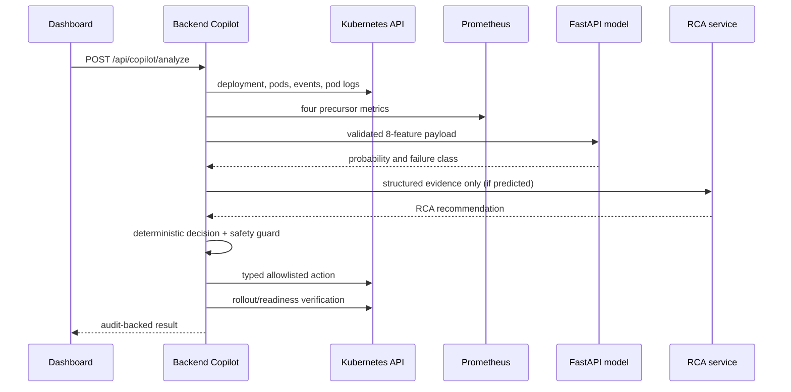

# Phase 6 — AI Copilot Self-Healing

Phase 6 connects the existing Phase 4 model and Phase 5 Kubernetes integration into a controlled loop. Autonomous recovery is implemented only for a configured allowlist of Kubernetes failure scenarios; it is not production-scale or unrestricted autonomy.

## Data contract

`backend/services/copilotFeature.service.js` is the single feature extraction path. It supplies exactly `cpu_usage`, `memory_usage`, `restart_count`, `error_rate`, `response_time`, `recent_deployment`, `log_error_count`, and `event_count`. CPU and memory values are computed as a percentage of the live Deployment container limits; latency is converted from Prometheus seconds to model milliseconds. Pod state, deployment state, and health state stay evidence/context only and are never model inputs.

Prometheus metrics, a Kubernetes Deployment with CPU and memory limits, pod logs, and events are required. Missing or malformed inputs return `TELEMETRY_UNAVAILABLE`; no defaults are invented.

## Control loop and safety

Authenticated `POST /api/copilot/analyze` resolves a registered service, reads Kubernetes and Prometheus directly, validates the model payload, and calls the canonical FastAPI predictor. A non-predicted outcome is audited and stops. A predicted outcome is sent with structured logs, events, and deployment context to the RCA service. If that service cannot respond, the result is `LLM_UNAVAILABLE`—there is no synthetic RCA.

The deterministic decision layer accepts only `RESTART_POD`, `SCALE_DEPLOYMENT`, `ROLLBACK_DEPLOYMENT`, and `RECREATE_RESOURCE`. Evidence mappings override an LLM recommendation where appropriate. The safety guard requires a registered target, allowlisted namespace, allowlisted action, Kubernetes credentials, and `COPILOT_RECOVERY_ENABLED=true`. No AI response can supply a shell command, namespace, resource name, YAML, or kubectl command.

The backend permits one in-process recovery at a time for each namespace/deployment target. A concurrent request receives `RECOVERY_ALREADY_RUNNING` and cannot dispatch another action.

Kubernetes actions use typed API calls only. Restart/recreate deletes a selected Deployment-owned pod; scale patches the Deployment scale subresource; rollback selects the previous owned ReplicaSet template and patches the Deployment. Every action captures before/after state, waits for the existing Kubernetes rollout evaluator, and re-queries the relevant Prometheus metrics. Results are `RECOVERY_VERIFIED`, `RECOVERY_FAILED`, or `RECOVERY_INCONCLUSIVE`; dispatch success is never treated as recovery success.

Incidents retain prediction, evidence, RCA, and resolution state. Recovery actions retain target, confidence, timestamps, verification result, and error, without secrets.

## Controlled demonstrations

The existing controlled demo manifests remain the supported scenarios: CrashLoopBackOff, OOM/high CPU, failed deployment, bad configuration, and unhealthy pods. Enable recovery only in a controlled environment after applying the existing RBAC/manifests and configuring Prometheus, Kubernetes credentials, resource limits, and `COPILOT_ALLOWED_NAMESPACES`.

## Verification and limitations

Unit checks cover the feature contract, missing telemetry, LLM unavailability, allowlisting, and Kubernetes-unavailable behavior. Live E2E verification is blocked unless a local Kubernetes cluster and Prometheus instance are configured; this implementation does not report an E2E success without those services.

The current recovery loop performs one safety-validated action per analysis request. Existing legacy recovery cooldown/retry behavior remains available for its endpoint; a future phase should consolidate retry persistence, add explicit post-action Prometheus condition comparison, and use a distributed lock if the backend is deployed with multiple replicas.
