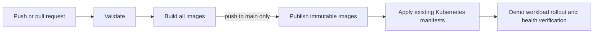

# Phase 7 — GitHub Actions Deployment

## Scope and detected architecture

Phase 7 updates the existing `.github/workflows/build.yml` workflow. The repository has Dockerfiles for the backend, FastAPI AI service, React frontend, and demo checkout service. Its Kubernetes manifests deploy Prometheus and the `demo-checkout-service` workload in the `devops-copilot` namespace. There are no Kubernetes manifests for the backend, frontend, AI service, or MongoDB, so this phase does not invent deployments for them.

## Workflow behavior

`build.yml` runs on every push, every pull request, and manual dispatch.

The validation job uses Node.js 20 and Python 3.11 and runs:

- `npm --prefix backend ci` and `npm --prefix backend test`
- `npm --prefix frontend ci` and `npm --prefix frontend run build`
- `python -m pytest ai-service/tests ml/tests`
- `git diff --check`
- cluster-independent Kubernetes manifest validation with kubeconform

Only after validation succeeds, the workflow builds backend, AI service, frontend, and demo-workload Docker images. These pull-request builds are not pushed to a registry.

On a push to `main`, the publish/deploy job uses the immutable twelve-character commit SHA tag. It pushes all four images to Docker Hub, applies the existing RBAC, Prometheus, and demo workload manifests, sets the demo workload image to the immutable tag, waits for Prometheus and demo workload rollouts, checks desired/updated/available/ready replicas, and calls the deployed demo workload `/health` endpoint from a ready pod.

The deployed Kubernetes workload is intentionally limited to the existing demo application. The backend, frontend, AI service, and MongoDB remain locally supported through `docker-compose.yml` until their own manifests are explicitly added in a later, separately scoped phase.

## Required GitHub Actions secrets

The `publish-and-deploy` job fails before any registry or cluster action when any of these repository/environment secrets are absent:

| Secret | Purpose |
|---|---|
| `DOCKERHUB_USERNAME` | Docker Hub namespace for immutable image tags |
| `DOCKERHUB_TOKEN` | Docker Hub token used only by the registry login action |
| `KUBE_CONFIG` | Complete kubeconfig for the target Kubernetes cluster |

The workflow never writes application secrets such as `JWT_SECRET` or `LLM_API_KEY` into frontend build variables. The current Kubernetes workload does not deploy services that consume those values.

## Failure behavior and verification

Every stage is dependency-gated. A failed test, frontend build, manifest validation, Docker build, registry push, manifest apply, rollout check, replica check, or `/health` call fails the workflow. Warning-event and pod-list commands run only to provide diagnostics after a known rollout verification failure; they do not mask that failure.

Deployment is verified only by live Kubernetes responses in the deploy job. A local run of tests or workflow syntax checks is not a deployment. No live deployment was performed while implementing Phase 7 because no GitHub Actions secrets or reachable CI target cluster were supplied.

## Manual deployment

After configuring the three secrets and protecting the `production` GitHub environment as appropriate, use **Actions → Phase 7 CI/CD and Kubernetes Deployment → Run workflow** on `main`, or push a reviewed commit to `main`. A manual run from another ref executes validation and image builds but deliberately does not publish or deploy.

## Limitations

- GitHub Actions execution and live cluster verification require external GitHub and Kubernetes credentials.
- The workflow deploys only manifests that already exist in this repository.
- The Docker Hub registry must permit the configured account to push the four image repositories.
